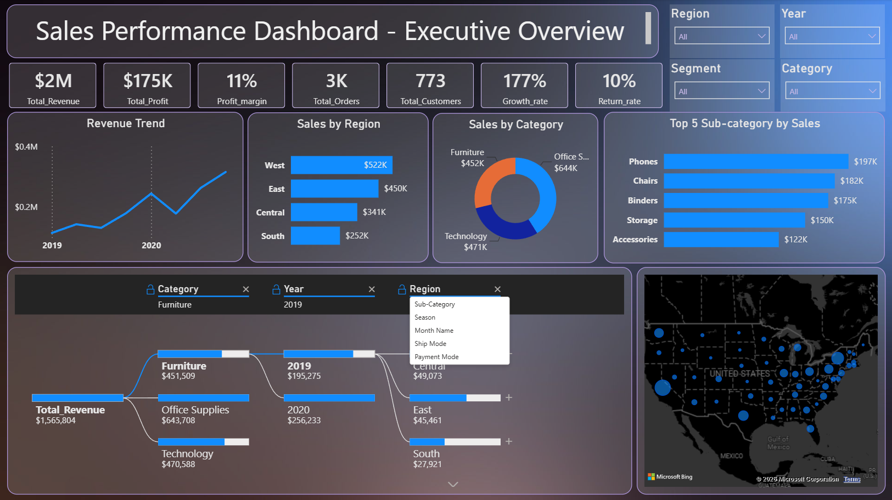
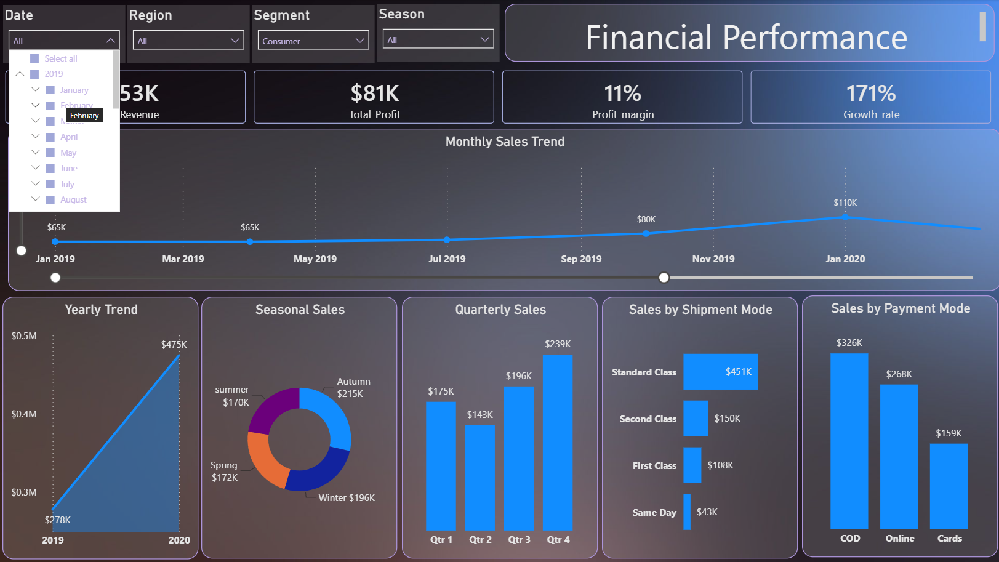
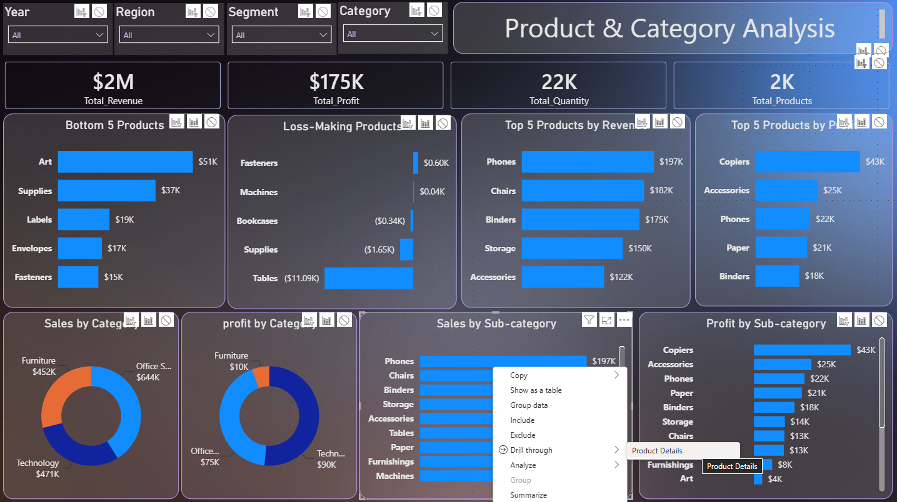
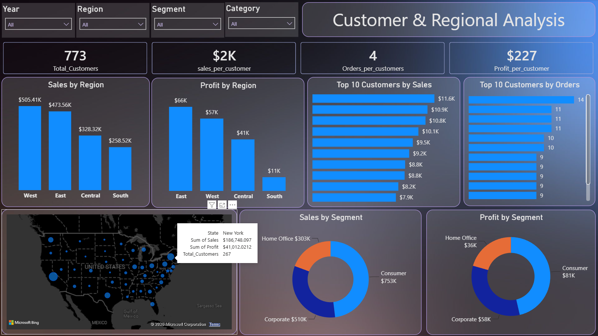
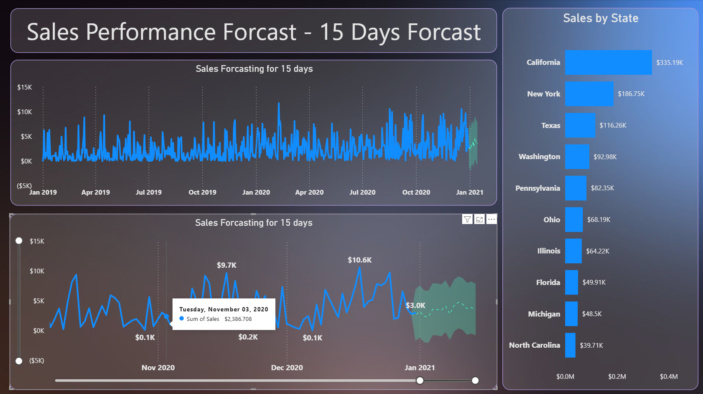

# 📊 Sales Performance Dashboard

An end-to-end Business Intelligence project that transforms raw sales data into an interactive Power BI dashboard for monitoring business performance, identifying sales trends, evaluating profitability, and supporting strategic decision-making.

The project demonstrates the complete BI workflow from business understanding, data preparation, data modeling, DAX development, to interactive dashboard design following industry best practices.

---

# 📌 Project Overview

Organizations generate thousands of sales transactions every day. Raw transactional data alone provides limited value unless it is transformed into meaningful business insights.

This project builds a professional Sales Performance Dashboard that enables stakeholders to:

- Monitor sales performance over time
- Analyze profitability
- Evaluate products and categories
- Compare regional performance
- Analyze customer behavior
- Monitor returned orders
- Support business decisions through KPIs and interactive visualizations

---

# 🎯 Project Objectives

The main objectives of this project are:

- Import and clean raw sales data
- Build a robust ETL process using Power Query
- Design a Star Schema data model
- Develop reusable DAX measures
- Calculate business KPIs
- Create interactive Power BI dashboards
- Apply time intelligence analysis
- Enable drill-through analysis
- Deliver an executive-level reporting solution

---

# 📋 Business Requirements

The dashboard must answer the following business questions:

### Sales Trends
- Is the business growing over time?
- Which month generates the highest sales?
- Which season performs best?
- What is the return rate?

### Sales Performance
- What is the total revenue?
- What is the total profit?
- What is the average order value?
- Which shipment mode generates the highest sales?
- Which payment method performs best?

### Product Analysis
- Which products generate the highest sales?
- Which products are most profitable?
- Which products should receive additional marketing investment?
- Which products are loss-making?

### Customer Analysis
- Who are the highest-value customers?
- Which customer segment generates the highest profit?
- How many repeat customers do we have?

### Regional Analysis
- Which region generates the highest revenue?
- Which region is most profitable?
- Which regions deserve expansion?

### Category Analysis
- Which category contributes the highest sales?
- Which sub-category performs best?

### Return Analysis
- Which regions have the highest return rates?
- Which products are returned most frequently?

---

# ⭐ Dashboard Features

The dashboard includes:

- Executive Overview
- Sales Performance Analysis
- Product Performance Analysis
- Customer Analysis
- Regional Analysis
- Category Analysis
- Return Analysis
- Interactive KPI Cards
- Dynamic Slicers
- Cross Filtering
- Drill-through Pages
- Dynamic Titles
- Time Intelligence Analysis
- Professional Navigation
- Responsive Layout

---

# 🛠 Technologies & Tools

| Category | Technology |
|----------|------------|
| BI Tool | Power BI Desktop |
| ETL | Power Query |
| Data Modeling | Star Schema |
| Calculations | DAX |
| Documentation | Microsoft Excel |
| Version Control | Git & GitHub |

---

# 📂 Project Structure

```text
Sales_Performance_Dashboard/

│
├── data/
├── docs/
├── dashboard/
├── outputs/
├── python_scripts/
├── presentation/
├── README.md
└── requirements.txt
```

---

# 🔄 Project Implementation Phases

## ✅ Phase 1 — Business Understanding

- Business Objectives
- Business Requirements
- Business Questions
- KPI Definitions
- Dashboard Scope

---

## ✅ Phase 2 — Data Understanding

- Dataset Review
- Data Dictionary
- Data Quality Assessment
- Fact & Dimension Identification

---

## ✅ Phase 3 — Data Preparation (ETL)

- Import Dataset
- Clean Data
- Handle Null Values
- Remove Duplicates
- Create Derived Columns
- Build Date Table
- Create Reference Tables
- Build Final Fact Table

---

## ✅ Phase 4 — Data Modeling

- Build Star Schema
- Create Relationships
- Optimize Data Model

---

## ✅ Phase 5 — DAX Development

- Base Measures
- Financial KPIs
- Time Intelligence
- Customer KPIs
- Product KPIs
- Regional KPIs
- Business Measures

---

## ✅ Phase 6 — Dashboard Development

- Executive Overview
- Sales Performance
- Product Analysis
- Customer Analysis
- Regional Analysis
- Category Analysis
- Return Analysis
- Navigation
- Drill-through
- Interactive Slicers

---

# 📈 Key Performance Indicators

Examples include:

- Total Revenue
- Total Profit
- Profit Margin
- Average Order Value
- Growth Rate
- Return Rate
- Total Customers
- Total Orders
- Total Quantity Sold
- Sales by Region
- Profit by Category
- Top Products
- Top Customers

---

# 📸 Dashboard Screenshots

## Executive Overview



---

## Sales Performance



---

## Product & Category Analysis



---

## Customer & Regional Analysis



---

## Forcasting



---

# 📊 Skills Demonstrated

- Business Analysis
- KPI Development
- Data Cleaning
- ETL Design
- Data Modeling
- Star Schema
- Power Query
- DAX
- Time Intelligence
- Dashboard Design
- Data Visualization
- Business Intelligence
- Git & GitHub

---

# 🚀 Future Improvements

Potential enhancements include:

- Row-Level Security (RLS)
- Mobile Layout
- Incremental Refresh
- SQL Data Source Integration
- Python/R Visuals
- Power BI Service Deployment

---

# 👩‍💻 Author

**Samira Kiriti**

## 📫 Connect with Me

- [LinkedIn Profile](https://www.linkedin.com/in/samira-kriti/)

Data Analyst | Business Intelligence | Power BI | SQL | Python | Excel

[https://www.linkedin.com/in/samira-kriti/]: https://www.linkedin.com/in/samira-kriti/